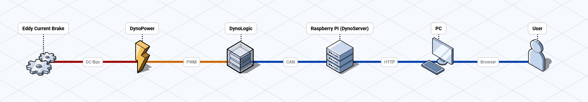
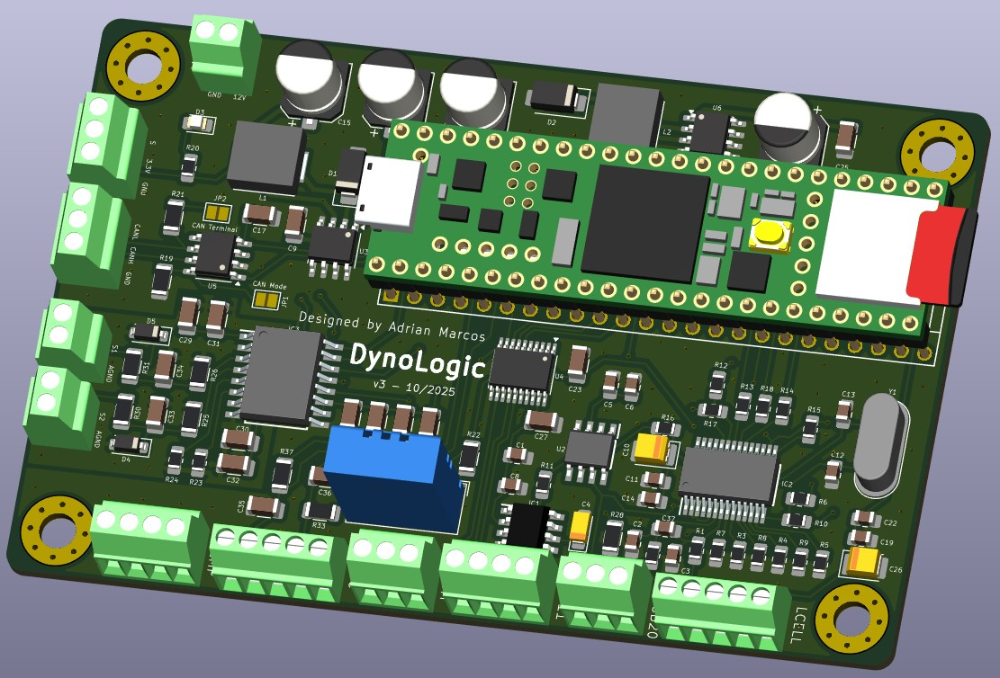
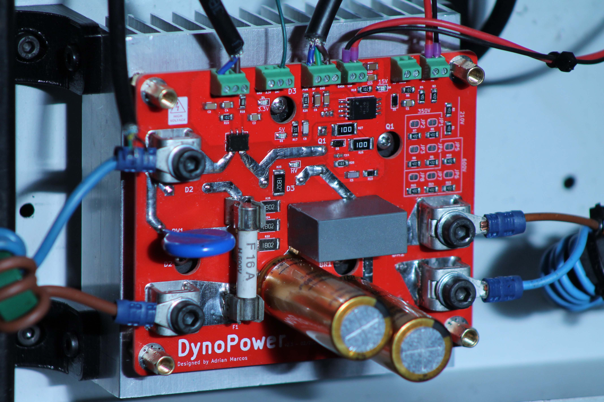
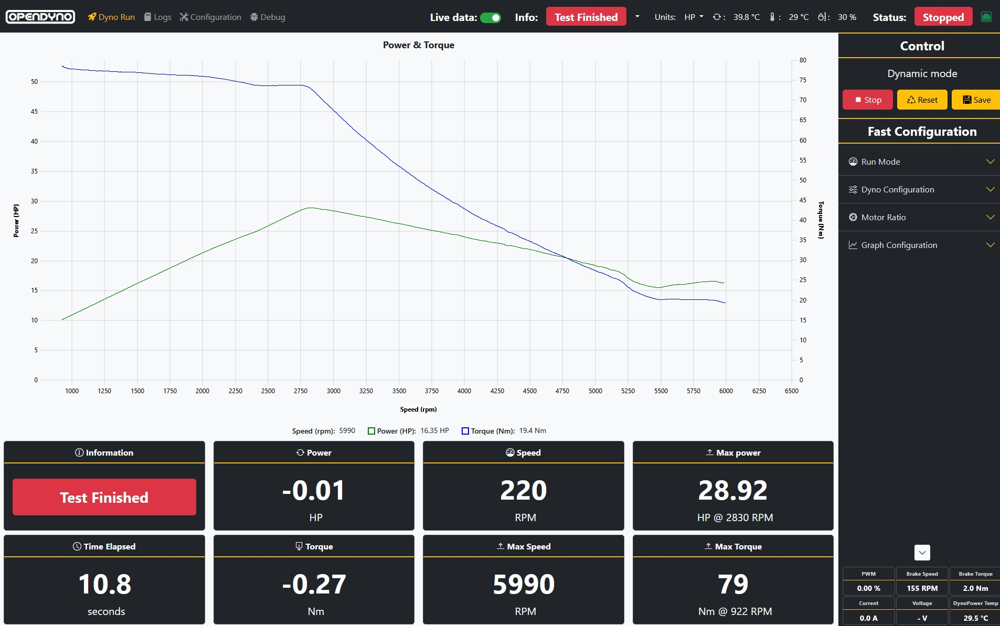

# OpenDyno - Open Dynamometer System

> Professional open-source motor dynamometer testing platform.

📖 **Read the full development story:** [Building a Dynamometer From Scratch](https://blog.ms02.es/posts/building-a-dynamometer-from-scratch/)

---

## Overview

**OpenDyno** is a complete open-source dynamometer software and hardware system designed for precise motor/engine performance testing. It is built primarily to control eddy current brakes (it should also support inertia brakes, though this is currently untested).

---

## Architecture

The project is divided into three core parts:

| Component     | Description |
|---------------|-------------|
| **DynoPower** | A power stage PCB designed to control the energy delivered to the eddy current brake. |
| **DynoLogic** | A control PCB running custom firmware. It is responsible for controlling the entire system, executing the logic software, running the PID loops, and managing all safety controls. |
| **DynoServer**| A Flask-based server that can run on a Raspberry Pi or any standard computer. It connects to DynoLogic via CAN bus and acts as the system's user interface. Using WebSockets, it serves a webpage to the browser, allowing the user to configure settings, start/stop tests, store and analyze data, and monitor the brake in real time. |

### Auxiliary Hardware
- **IGBT Power**: An auxiliary power supply board that converts AC mains to 15V to power the IGBT gate driver on the DynoPower board.
  - *Note*: This board is designed to output both +15V and -5V, but **only the positive (+15V) components need to be populated** for the OpenDyno system.

## System

### DynoLogic

### DynoPower

### DynoServer

---

## Key Features

- **Four Control Modes**: Constant Torque, Constant Speed, Dynamic Testing (automated state machine), and Acceleration Rate Control.
- **Real-Time Telemetry**: 100 Hz live data streaming (speed, torque, power, acceleration) via WebSocket.
- **PID Control**: High-frequency closed-loop PID control running at 1 kHz for maximum responsiveness.
- **Data Filtering**: Built-in signal processing including filters to ensure smooth and accurate sensor readings (e.g., from the load cell).
- **Thermal Monitoring**: Support for multiple temperature sensors to monitor brake and ambient temperatures.
- **Safety Limits**: User-configurable maximum speed and maximum PWM limits to protect the eddy current brake from thermal runaway, alongside minimum speed protection, a heartbeat watchdog, and emergency stop.
- **Web Interface**: Responsive UI with live charts.
- **Test Comparison**: Built-in capability to overlay and compare two different test runs directly within the user interface.
- **Selectable Power Units**: Toggle between Kilowatts (kW) and Horsepower (HP) for power measurements.

---

## Operating Modes

OpenDyno supports multiple test modes to thoroughly characterize your motor/engine:

### 1. Dynamic Mode
Automates an entire test run (e.g., accelerating from a minimum to a maximum speed and then decelerating). It uses a state machine to guarantee repeatable and standardized power sweeps.

### 2. Acceleration Mode
Maintains a constant acceleration rate (RPM/s) to smoothly sweep through the motor's power band, ensuring consistent and comparable power measurements regardless of the motor's natural acceleration.

### 3. Torque Mode
Applies a fixed braking torque to the motor regardless of the speed. Useful for thermal testing and checking steady-state efficiency under a specific load.

### 4. Speed Mode
Adjusts the braking force dynamically to hold the motor at an exact RPM, regardless of the throttle position. Perfect for mapping fuel or ignition tables across different RPM bands.

---

## Hardware Specifications

### DynoLogic Control Board
- **MCU**: Teensy 4.1 (600 MHz ARM Cortex-M7)
- **Encoder**: Quadrature input, 50 PPR ×4 (200 counts/rev) with DWT cycle-counter timing
- **Load Cell**: 24-bit ADC (HX711 or ADS1220 selectable at compile time)
- **Brake Control**: 16-bit PWM @ 1 kHz on pin 4
- **Sensors**: MLX90614 IR temperature, BME280 (T+RH), DS18B20, Hall current sensor
- **Communication**: CAN 2.0B @ 500 kbps + USB serial debug @ 500000 baud

### DynoPower Power Board
- **Power Stage**: IGBT-based eddy current brake power stage with isolated gate drive. Rated for up to 1200V and 160A.
- **Rectification**: GBJ5010 bridge rectifier + bulk capacitance
- **Protection**: Thermal monitoring
- **Connectors**: High-current power terminals + 4-pin control interface

### Pinouts & Connectors
See detailed pin assignments in `DynoLogic/README.md` and KiCad schematics.

---

## Getting Started

Building and configuring the OpenDyno system is a multi-step process that involves:

1. Manufacturing and assembling the PCBs (DynoPower, DynoLogic, IGBT Power).
2. Sourcing the components and sensors.
3. Wiring the system.
4. Flashing the DynoLogic firmware.
5. Deploying and configuring the DynoServer software.

To make this process as smooth as possible, we have compiled a comprehensive, chronological step-by-step guide.

> [!IMPORTANT]
> **Please follow the full setup guide here:** [GETTING_STARTED.md](GETTING_STARTED.md)

For detailed configuration parameters and deep-dive technical references, consult the respective component documentation:
- **DynoLogic Reference**: [DynoLogic/README.md](DynoLogic/README.md)
- **DynoPower Reference**: [DynoPower/README.md](DynoPower/README.md)
- **DynoServer Reference**: [DynoServer/README.md](DynoServer/README.md)

---

## Documentation

| Document | Location | Description |
|----------|----------|-------------|
| DynoLogic Reference | `DynoLogic/README.md` | Hardware assembly, firmware compilation, CAN protocol, and configuration parameters |
| DynoPower Reference | `DynoPower/README.md` | Complete guide for the IGBT power stage and brake driver |
| DynoServer Reference| `DynoServer/README.md` | Complete guide for headless Raspberry Pi deployment with systemd |

---

## Safety Warning

⚠️ **This system controls high-power rotating machinery and eddy current brakes.**

- Always use an emergency stop within immediate reach
- Verify all mechanical couplings before applying power
- Never exceed the mechanical or thermal limits of your brake or motor
- Test PID gains at low power first
- Follow all local electrical and mechanical safety regulations

---

## ⚠️ Critical Power-On Sequence

**DynoPower MUST be connected to AC mains ONLY AFTER DynoLogic has fully started and the web UI shows "Connected".**

Failure to follow this sequence can result in:
- Uncontrolled brake actuation on power-up
- Damage to power electronics or eddy current brake

**Correct startup order:**
1. Power on DynoLogic (Teensy boots, firmware initializes)
2. Start DynoServer and verify CAN connection (green "Connected" indicator)
3. **Then** apply AC mains power to DynoPower

**Shutdown order (reverse):**
1. Stop any running test via web UI
2. Remove AC mains power from DynoPower first
3. Power off DynoLogic / DynoServer

---

## Notes to Users

- The system has only been tested with a few amps of power, even though the IGBT supports up to 160A.
- The MAX22530AWE has not been tested in the system. The schematic measures voltage, but isolation has not been tested, and the code for it is not written yet.

---

## License

This project is released under the **Creative Commons Attribution-NonCommercial-ShareAlike 4.0 International (CC BY-NC-SA 4.0)** license:

- ✅ Free to use for personal, educational, and research purposes
- ✅ Must provide attribution to the original authors
- ❌ **Not permitted for commercial use** or any activity that generates revenue
- 🔄 Any modifications or derivative works **must be published** under the exact same license

See the full [LICENSE](LICENSE) file for legal text.

---

*Use at your own risk.*
